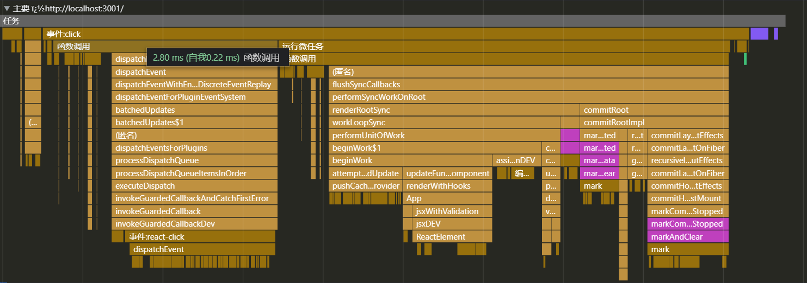

## react架构调度模型


## 首屏


performWorkUntilDeadline // 执行工作单元，直到时间结束

flushWork // 清洗工作

workLoop // 循环工作

performConcurrentWorkOnRoot // 对root执行 并行 的工作

​	performUnitOfWork // 执行工作单元

​	completeUnitOfWork // 完成工作单元

​	completeWork // 去完成工作 !TODO 重要


目前认知的一些函数及作用

ReactFiberCompleteWork.js  export { completeWork } // 负责标示任务类型 用于 commit 

createFiberFromElement 根据JSX节点创建fiber元素

beginWork 函数每次执行只创建1个 节点 只处理最小的1个工作单元

finalizeInitialChildren 设置DOM节点属性


ensureRootIsScheduled 在 commit 阶段的尾部 再次将root交给调度器 schedule ，确保新的新的更新被处理。 确保root处于schedule


首次渲染

| 架构流程      | 文件名                      | 方法                  | 职责                        |      |
| ------------- | --------------------------- | --------------------- | --------------------------- | ---- |
| 协调          |                             |                       |                             |      |
|               |                             |                       |                             |      |
|               |                             |                       |                             |      |
|               |                             |                       |                             |      |
| 调度Scheduler |                             |                       |                             |      |
|               |                             |                       |                             |      |
|               | ReactFiberCompleteWork.js   | completeWork          | 根据 workInProgress.tag执行 |      |
|               |                             |                       |                             |      |
|               |                             |                       |                             |      |
|               |                             |                       |                             |      |
|               |                             |                       |                             |      |
| render阶段    |                             |                       |                             |      |
|               |                             |                       |                             |      |
|               |                             |                       |                             |      |
|               |                             |                       |                             |      |
|               |                             |                       |                             |      |
|               |                             |                       |                             |      |
| commit阶段    | ReactFiberCommitWork.old.js | commitMutationEffects |                             |      |
|               |                             |                       |                             |      |
|               |                             |                       |                             |      |
|               |                             |                       |                             |      |
|               |                             |                       |                             |      |
|               |                             |                       |                             |      |


## mount挂载


> ### render 阶段
>
> 1. 首次渲染的时候 curent Fiber 是不存在的，此时正在构建 workInProgress
>
> 递 => 扫描到最底部全部 jsx => 生成 fiber => 创建对应的DOM ，return 到上个兄弟节点
>
> 归 => root 挂载好刚刚递形成的 DOM tree => flags为Placment 最终挂载到root上
>
> ### commit阶段
>
> finishConcurrentRender 根据 RootExitStatus 执行 commitRoot
>


diff 算法入口 reconcileChildren


## 更新




## update


> ### render 阶段 **reconciler** 协调
>
>   1. scheduleUpdateOnFiber 所有fiber输入工作的入口
>
>      1. ensureRootIsScheduled  
>        1. 判断是否需要注册task，会提前退出,
>         2. 判断优先级，
>        3. 注册task(scheduleSyncCallback | scheduleLegacySyncCallback | .. ) 
>             4. 执行 注册并添加到 queue中的task 通过 flushSyncCallbacks 
>
>     
>
>     ### commit阶段 
>        
>     ​	1.before mutation
>        
>     ​	2.mutation
>        
>     ​	3.layout


click 事件

dispatchSetState


## balabala

```js
<pre>
 *                       wrappers (injected at creation time)
 *                                      +        +
 *                                      |        |
 *                    +-----------------|--------|--------------+
 *                    |                 v        |              |
 *                    |      +---------------+   |              |
 *                    |   +--|    wrapper1   |---|----+         |
 *                    |   |  +---------------+   v    |         |
 *                    |   |          +-------------+  |         |
 *                    |   |     +----|   wrapper2  |--------+   |
 *                    |   |     |    +-------------+  |     |   |
 *                    |   |     |                     |     |   |
 *                    |   v     v                     v     v   | wrapper
 *                    | +---+ +---+   +---------+   +---+ +---+ | invariants
 * perform(anyMethod) | |   | |   |   |         |   |   | |   | | maintained
 * +----------------->|-|---|-|---|-->|anyMethod|---|---|-|---|-|-------->
 *                    | |   | |   |   |         |   |   | |   | |
 *                    | |   | |   |   |         |   |   | |   | |
 *                    | |   | |   |   |         |   |   | |   | |
 *                    | +---+ +---+   +---------+   +---+ +---+ |
 *                    |  initialize                    close    |
 *                    +-----------------------------------------+
 * </pre>
```

