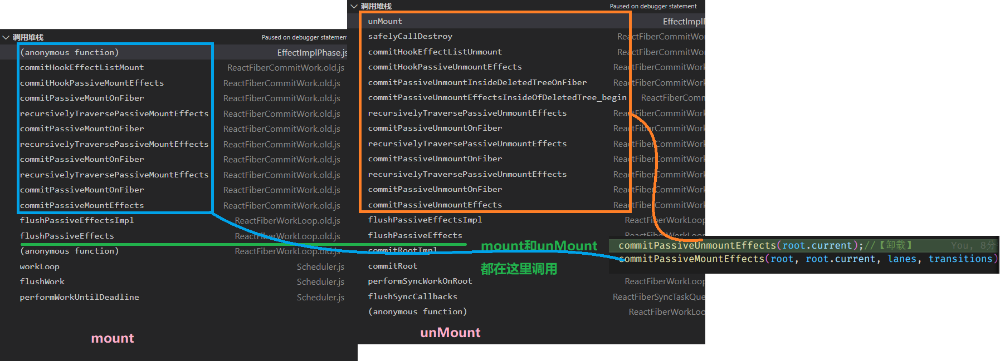

# reactFiberHooks


[hooks 钩子方法，是React提供的用于介入 react 生命周期的 API](https://zh-hans.reactjs.org/docs/hooks-intro.html)

## 1.关于hooks各个方法在不同时机下的指向不同的实现


```js
ReactCurrentDispatcher.current //【全局变量】 当前的分发器


ContextOnlyDispatcher // 抛出错误的分发器

HooksDispatcherOnMount | HooksDispatcherOnMountInDEV 

HooksDispatcherOnUpdate | HooksDispatcherOnUpdateInDEV

HooksDispatcherOnRerender | HooksDispatcherOnRerenderInDEV


HooksDispatcherOnMountWithHookTypesInDEV

InvalidNestedHooksDispatcherOnMountInDEV

InvalidNestedHooksDispatcherOnUpdateInDEV

InvalidNestedHooksDispatcherOnRerenderInDEV
```


# State Hook

## useState流程

1. mount 时

   > 1. hook = mountWorkInProgressHook() ; 创建1个hook，并挂载到 WorkInProgressHook 或挂载到其next上，并返回 WorkInProgressHook；
   > 2. 创建 queue 并挂载到 hook 上 【重要】
   > 3. 通过 bind 绑定当前 fiber 和 queue , 并返回1个dispatch函数
   >
   > 随后等待进入下一个阶段

2. render时

   >
   >
   >

3. update时

   >1. hook = updateWorkInProgressHook()；找到并返回 workInProgressHook
   >2. 取出当前hook的 queue 【重要】
   >3. 循环 update链表 计算newState 并赋值到hook上 , 如果新旧的state不一样会打上标记receivedUpdate  【重要】【这步复杂点】
   >4. 返回 [state,dispatch]
   >

useState 极简实现 DEMO 来自娱乐圈卡颂

```html
<!DOCTYPE html>
<html lang="en">
<head>
  <meta charset="utf-8" />
  <meta name="viewport" content="width=device-width, initial-scale=1" />
  <meta name="theme-color" content="#000000" />
  <meta name="description" content="Web site created using create-react-app" />
  <title>React App</title>
</head>
<body>
  <div id="root"></div>
  <script>
    let isMount = true
    let workInProgressHook = null
    let currentlyRenderingFiber = {
      memoizedState: null,
      stateNode: App
    }

    function dispatchSetState(queue, action) {
      // 创建 update 
      const update = {
        action,
        next: null
      }

      // 入队更新 形成循环链表 enqueueRenderPhaseUpdate
      if (queue.pending === null/*判断是否存在cyc链表 */) {
        update.next = update
      } else {
        update.next = queue.pending.next  // 当前的指向原来的第1个
        queue.pending.next = update // 原来的
      }
      queue.pending = update

      run() // schedule
    }

    function useState(initialState) {
      let hook = null
      if (isMount) {
        /* 初始化阶段 */
        initialState = typeof initialState === "function" ? initialState() : initialState;

		//创建 hook mountWorkInProgressHook | updateWorkInProgressHook
        hook = {
          memoizedState: initialState,
          next: null,
          queue: {
            pending: null
          },
        }
		//挂载 hook
        if (!currentlyRenderingFiber.memoizedState) {
          currentlyRenderingFiber.memoizedState = hook
        } else {
          workInProgressHook.next = hook
        }
		//赋值到当前
        workInProgressHook = hook

      } else {
        /* 更新阶段 */
        hook = workInProgressHook
        workInProgressHook = workInProgressHook.next
      }

      /* 此时 hook 指向 workInProgressHook */

      let baseState = hook.memoizedState // 先拿到传入的值

      const queue = hook.queue
      /* 检查是否右需要计算的状态 updateReducer */
      if (queue.pending) {
        const pendingFirstQueue = queue.pending.next
        let update = pendingFirstQueue
        do {
          const action = update.action
          baseState = action(baseState)
          update = update.next
        } while (pendingFirstQueue !== update)

        hook.queue.pending = null
      }

      hook.memoizedState = baseState

      return [hook.memoizedState, dispatchSetState.bind(null, hook.queue)]
    }


    function App() {
      const [num, setNum] = useState(0)
      const [is, setIs] = useState('莫')

      console.log('isMount:', isMount, 'num:', num, "is:", is);

      return {
        onClick() {
          setNum(num => num + 1)
        },
        onSet() {
          setIs(is => {
            return is + Math.random().toFixed()
          })
        }
      }
    }

    function run() {
      workInProgressHook = currentlyRenderingFiber.memoizedState
      const app = currentlyRenderingFiber.stateNode() // App
      isMount = false
      return app
    }
      
    window.app = run()
    console.log('run')
  </script>
</body>
</html>
```

# Effect Hook

## useEffect

1. mount 时

   >1. hook = mountWorkInProgressHook() ; 创建1个hook，并挂载到 WorkInProgressHook 或挂载到其next上，并返回 WorkInProgressHook；
   >
   >2. 挂载 flags 
   >3. hook.memoizedState = pushEffect() ；创建并返回 effect 对象（根据componentUpdateQueue的状态，构建effect环形链表），挂载到该hoos上；

   ```js
   function mountEffectImpl(
     fiberFlags,
     hookFlags,
     create,
     deps: Array<mixed> | void | null,
   ): void {
     const hook = mountWorkInProgressHook();
     const nextDeps = deps === undefined ? null : deps;
     currentlyRenderingFiber.flags |= fiberFlags;
     hook.memoizedState = pushEffect(
       HookHasEffect | hookFlags,
       create,
       undefined,
       nextDeps,
     );
   }
   ```

   

2. update时

   >1. hook = updateWorkInProgressHook()；找到并返回 workInProgressHook 
   >2. 比对 deps 无论是否相同 ，都会调用 pushEffect 在effect链表上挂载effect ，区别在于传入的 hookflags

   ```js
   function updateEffectImpl(fiberFlags,hookFlags,create,deps: Array<mixed> | void | null,): void {
     const hook = updateWorkInProgressHook();
     const nextDeps = deps === undefined ? null : deps;
     let destroy = undefined;
   
     if (currentHook !== null) {
       const prevEffect = currentHook.memoizedState;
       destroy = prevEffect.destroy;
       if (nextDeps !== null) {
         const prevDeps = prevEffect.deps;
         if (areHookInputsEqual(nextDeps, prevDeps)) { // 比对 本次和上次的 deps 是否有改变 ；无论deps是否改变 都要 pushEffect 因为 effect链表顺序不可以变
           hook.memoizedState = pushEffect(hookFlags, create, destroy, nextDeps); // 创建effect 【tag】
           return;//currentlyRenderingFiber.updateQueue.lastEffect === hook.memoizedState
         }
       }
     }
   
     currentlyRenderingFiber.flags |= fiberFlags; // 挂载 tag 
   
     hook.memoizedState = pushEffect(
       HookHasEffect | hookFlags,
       create,
       destroy,
       nextDeps,
     );
   }
   
   ```

3. commit 时 path `react\packages\react-reconciler\src\ReactFiberWorkLoop.old.js`

   >1. commit 阶段 先执行 flushPassiveEffect 先一次清理副作用 // 每次执行effect 产生的新的 effect 再清理一下
   >2. commit 阶段 若子树或root上有 passive 则再注册1个 scheduleCallback(NormalSchedulerPriority,()=>flushPassiveEffect()) // useEffect 执行时机 这里是scheduler调度 异步的
   >3. 在这3个阶段会将 mutation 作用于 fiber
   >   1. before 	prepareForCommit -> commitBeforeMutationEffects_begin
   >   2. commit     commitMutationEffectsOnFiber // DOM操作
   >   3. layout     commitLayoutEffectOnFiber    // useLayoutEffect 执行时机 这里是同步的
   >
   >4. ensureRootIsScheduled //
   >5. flushPassiveEffects //
   >6. flushSyncCallbacks // 
   >7. scheduleCallback(IdleSchedulerPriority,()=>{}) // 调度idle优先级任务
   >
   
   
   
   ```js
   function commitRootImpl(
     root: FiberRoot,
     recoverableErrors: null | Array<CapturedValue<mixed>>,
     transitions: Array<Transition> | null,
     renderPriorityLevel: EventPriority,
   ) {
     do {
       flushPassiveEffects();
     } while (rootWithPendingPassiveEffects !== null);
     //...
     if (
       (finishedWork.subtreeFlags & PassiveMask) !== NoFlags ||
       (finishedWork.flags & PassiveMask) !== NoFlags
     ) {
       if (!rootDoesHavePassiveEffects) {
   
         pendingPassiveTransitions = transitions;
         scheduleCallback(NormalSchedulerPriority, () => {
           flushPassiveEffects();//注册清理副作用的 task
           return null;
         });
       }
     }
    //...
    }
   ```
   
   


## useLayoutEffect


大体与 useEffect 一致 ，区别在于，useEffect中的回调是 在 commit 阶段的 layout 阶段同步调用的，调用入口是 `commitLayoutEffects`


在 commitMutationEffectsOnFiber 中渲染 DOM 递归的遍历

## 结论

mount 基本时都在创建 hook 挂载 update effect ，打标记，只有在commit阶段，才会将具体的 mutation 应用到 fiber 上。(commitMutationEffectsOnFiber)
