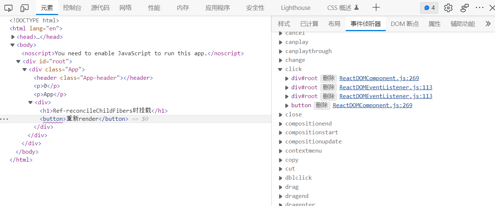
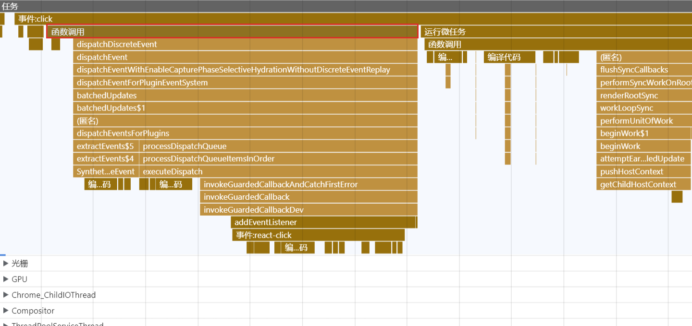

# 事件系统


## 事件监听


在 `createRoot` 中创建 fiberRoot ，然后为这个fiber对应的DOM元素`rootContainerElement`添加监听函数，包括冒泡和捕获阶段`2`种 `listenToAllSupportedEvents` ，代理其所有类型的事件监听。（除个别如scroll） 


## 事件派发

```js
export function dispatchEventForPluginEventSystem(
  domEventName: DOMEventName,
  eventSystemFlags: EventSystemFlags,
  nativeEvent: AnyNativeEvent,
  targetInst: null | Fiber,
  targetContainer: EventTarget,
): void {
  // ...
  batchedUpdates(() =>
    dispatchEventsForPlugins(
      domEventName,
      eventSystemFlags,
      nativeEvent,
      ancestorInst,
      targetContainer,
    ),
  );
}

function dispatchEventsForPlugins(
  domEventName: DOMEventName,
  eventSystemFlags: EventSystemFlags,
  nativeEvent: AnyNativeEvent,
  targetInst: null | Fiber,
  targetContainer: EventTarget,
): void {
  const nativeEventTarget = getEventTarget(nativeEvent);
  const dispatchQueue: DispatchQueue = [];
  extractEvents(
    dispatchQueue,
    domEventName,
    targetInst,
    nativeEvent,
    nativeEventTarget,
    eventSystemFlags,
    targetContainer,
  ); // 提取出 fiber 中的事件并构建 dispatchQueue
  processDispatchQueue(dispatchQueue, eventSystemFlags); // 执行根据事件类型来 遍历所有监听函数并调用 capture事件倒序遍历，bubble顺序遍历 listeners
}
```





