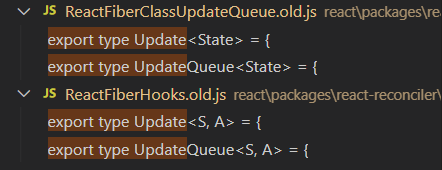
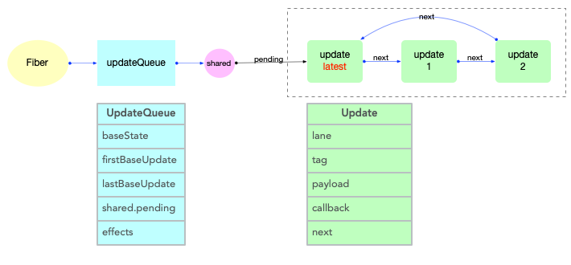

> 前言
>
> 关于 Update UpdateQueue存在两套，一个是负责Function的，另1为ReactFiberClassUpdateQueue 和 HostUpdateQueue 的。
>
> 猜测，由于Function Components 需要hooks来介入react的运行时，因此才有2套不一样的 `Update`
>
> 


## 相关的 global variable

```js
// 这些是在调用组件之前设置的

let renderLanes: Lanes = NoLanes; // 渲染的信道
let currentlyRenderingFiber: Fiber = (null: any); //为了不和 workInProgress 重名，等同于 workInProgress 【重要】
let currentHook: Hook | null = null;//指向 current.memoizedState // 当前钩子列表是属于当前光纤的列表。【重要】
let workInProgressHook: Hook | null = null;//workInProgress.memoizedState // 进行中工作挂钩列表是一个新列表，将添加到进行中工作光纤中。【重要】
let didScheduleRenderPhaseUpdate: boolean = false;
let didScheduleRenderPhaseUpdateDuringThisPass: boolean = false;


```


## Update 函数式的

Hook的数据结构

path:`packages\react-reconciler\src\ReactFiberHooks.old.js`

```ts
export type Update<S, A> = {
  lane: Lane,
  action: A,
  hasEagerState: boolean, // 是否为渴望的状态
  eagerState: S | null, // 渴望的状态
  next: Update<S, A>, 与其他Update连接形成链表。
};

export type UpdateQueue<S, A> = {
  pending: Update<S, A> | null,
  lanes: Lanes,
  dispatch: (A => mixed) | null,
  lastRenderedReducer: ((S, A) => S) | null,
  lastRenderedState: S | null,
};

export type Hook = {
  memoizedState: any, // 保持在内存中的局部状态.
  baseState: any,
  baseQueue: Update<any, any> | null,
  queue: any,
  next: Hook | null,
};

```


## ReactFiberClassUpdateQueue & HostUpdateQueue 类&主机队列

// 文件开头有非常信息的描述

path:`react\packages\react-reconciler\src\ReactFiberClassUpdateQueue.old.js`

```js
export type Update<State> = {|
  eventTime: number, // 发起update事件的时间(17.0.2中作为临时字段, 即将移出)
  lane: Lane, // update所属的优先级
  tag: 0 | 1 | 2 | 3, // 表示`update`种类, 共 4 种. UpdateState,ReplaceState,ForceUpdate,CaptureUpdate
  payload: any, // 载荷, 根据场景可以设置成一个回调函数或者对象
  callback: (() => mixed) | null, // 回调函数
  next: Update<State> | null, // 指向链表中的下一个, 由于UpdateQueue是一个环形链表, 最后一个update.next指向第一个update对象
|};

export type SharedQueue<State> = {
  pending: Update<State> | null,
  lanes: Lanes,
  hiddenCallbacks: Array<() => mixed> | null,
};

export type UpdateQueue<State> = {
  baseState: State,
  firstBaseUpdate: Update<State> | null,
  lastBaseUpdate: Update<State> | null,
  shared: SharedQueue<State>,
  callbacks: Array<() => mixed> | null,
};

export const UpdateState = 0;
export const ReplaceState = 1;
export const ForceUpdate = 2;
export const CaptureUpdate = 3;
```


### Update 和 UpdateQueue 对象

在`fiber`对象中有一个属性`fiber.updateQueue`, 是一个链式队列(即使用链表实现的队列存储结构), 后文会根据场景表述成链表或队列.

首先观察`Update`对象的数据结构([对照源码](https://github.com/facebook/react/blob/v17.0.2/packages/react-reconciler/src/ReactUpdateQueue.old.js#L106-L129)):

`updateQueue`是`fiber`对象的一个属性, 所以不能脱离`fiber`存在. 它们之间数据结构和引用关系如下:



注意:

- 此处只是展示数据结构和引用关系.对于`updateQueue`在更新阶段的实际作用和运行逻辑, 会在状态组件(class 与 function)章节中详细解读.


