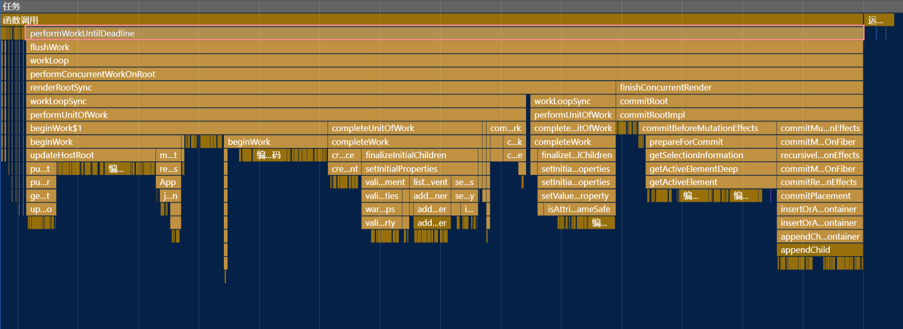

# concurrent mode first render

## 1.创建 FiberRootNode

创建也就是调用对外暴露 API `ReactDOM.createRoot`

### 过程：

​ createRoot() -> createContainer() -> return createFiberRoot() 最终返回 fiberRootNode

​ `react\packages\react-reconciler\src\ReactFiberReconciler.old.js`

#### 调用 `createRoot`

```js
export function createRoot(
  container: Element | Document | DocumentFragment,
  options?: CreateRootOptions
): RootType {
  // options 初始化 .. 省略

  // 创建 fiberRootNode           react很多调用跳来跳去 其实可以在1个方法里做
  const root = createContainer(
    container,
    ConcurrentRoot,
    null,
    isStrictMode,
    concurrentUpdatesByDefaultOverride,
    identifierPrefix,
    onRecoverableError,
    transitionCallbacks
  );
  //...
}
```

#### 进入 `createContainer`

```js
export function createContainer(
  containerInfo: Container,
  tag: RootTag,
  hydrationCallbacks: null | SuspenseHydrationCallbacks,
  isStrictMode: boolean,
  concurrentUpdatesByDefaultOverride: null | boolean,
  identifierPrefix: string,
  onRecoverableError: (error: mixed) => void,
  transitionCallbacks: null | TransitionTracingCallbacks
): OpaqueRoot {
  const hydrate = false;
  const initialChildren = null;
  return createFiberRoot(
    containerInfo,
    tag,
    hydrate,
    initialChildren,
    hydrationCallbacks,
    isStrictMode,
    concurrentUpdatesByDefaultOverride,
    identifierPrefix,
    onRecoverableError,
    transitionCallbacks
  );
}
```

#### 进入 `createFiberRoot`

```js
export function createFiberRoot(
  containerInfo: Container,
  tag: RootTag,
  hydrate: boolean,
  initialChildren: ReactNodeList,
  hydrationCallbacks: null | SuspenseHydrationCallbacks,
  isStrictMode: boolean,
  concurrentUpdatesByDefaultOverride: null | boolean,
  identifierPrefix: string,
  onRecoverableError: null | ((error: mixed) => void),
  transitionCallbacks: null | TransitionTracingCallbacks
): FiberRoot {
  const root: FiberRoot = (new FiberRootNode(
    containerInfo,
    tag,
    hydrate,
    identifierPrefix,
    onRecoverableError
  ): any);
  // ...
  root.current = uninitializedFiber; // current 指针所在
  uninitializedFiber.stateNode = root;

  if (enableCache) {
    // ...
  } else {
    const initialState: RootState = {
      element: initialChildren,
      isDehydrated: hydrate,
      cache: (null: any), // not enabled yet
    };
    uninitializedFiber.memoizedState = initialState; // 初始化组件状态
  }

  initializeUpdateQueue(uninitializedFiber); // 初始化更新队列

  return root;
}
```

#### 回到 `createRoot `并返回 `fiberRootNode`

```js
  // ...
  markContainerAsRoot(root.current, container);

  const rootContainerElement: Document | Element | DocumentFragment =
    container.nodeType === COMMENT_NODE
      ? (container.parentNode: any)
      : container;
  listenToAllSupportedEvents(rootContainerElement);

  return new ReactDOMRoot(root); // 结束并返回 fiberRootNode ,这一步将挂在render方法到原型链上
}

```

```ts
// 最终返回值类型
export type RootType = {
  _internalRoot: FiberRoot | null, // packages\react-reconciler\src\ReactInternalTypes.js
  [[Prototype]]:{
        render(children: ReactNodeList): void,
        unmount(): void,
  }
  ...
};
```

### 注意点

1. `fiberRootNode`的`current`会指向当前页面上已渲染内容对应`Fiber树`，即`current Fiber树`。
2. 在初始化时，由于还没有进行挂载因此现在的 `fiberRootNode.current` 是 1 颗空 `fiber tree`

```js
fiberRootNode = {
  current: {
    child: null,
  },
};
```

3. 接下来 render 时会尝试复用(diff) `fiberRootNode.current` 上的 fiber tree ，由于此时是空树，因此会根据 `JSX` 构建 `workInProgress`构建

## 2.注册更新任务 Scheduled

1. 将更新`{fiber,queue,update,lane}`入列 `concurrentQueues`，最终会由 reconciler 通过调用 prepareFreshStack 间接调用 finishQueueingConcurrentUpdates 时调用。主要作用是给 fiber 标记 lanes。

#### 调用`render`

调用 root 原型上的`render`方法，传入 1 个 ReactElement。

内部会调用 `updateContainer(children, root, null, null);`

```js
ReactDOMHydrationRoot.prototype.render = ReactDOMRoot.prototype.render =
  function (children: ReactNodeList): void {
    const root = this._internalRoot;
    if (root === null) {
      throw new Error("Cannot update an unmounted root.");
    }
    updateContainer(children, root, null, null);
  };
```

#### 调用 updateContainer

```js
export function updateContainer(
  element: ReactNodeList,
  container: OpaqueRoot,
  parentComponent: ?React$Component<any, any>,
  callback: ?Function
): Lane {
  const current = container.current; // mount时实际就是 FiberRootNode ，current属性则是创建阶段初始化的 createHostRootFiber() 返回值
  const eventTime = requestEventTime(); // 获得一下时间， 和reconciler 协调器有关 ； 具体不详 应该是和时间切片相关？
  const lane = requestUpdateLane(current); // 每次更新都会调用该方法 获得本次更新的优先级

  if (enableSchedulingProfiler) {
    markRenderScheduled(lane);
  }

  const context = getContextForSubtree(parentComponent); // 上下文， 全局状态的注入就是这里
  if (container.context === null) {
    container.context = context;
  } else {
    container.pendingContext = context;
  }

  const update = createUpdate(eventTime, lane); // 创建1个描述更新信息的对象 包含 lane、eventTime、tag 、next ...
  // Caution: React DevTools currently depends on this property
  // being called "element".
  update.payload = { element }; // 给 React DevTools 插件用的

  callback = callback === undefined ? null : callback; // mount 的时候 是没有 传入 callback 的
  if (callback !== null) update.callback = callback;

  const root = enqueueUpdate(current, update, lane); // 将 update 入队至更新队列
  if (root !== null) {
    scheduleUpdateOnFiber(root, current, lane, eventTime);
    entangleTransitions(root, current, lane);
  }

  return lane;
}
```

#### 调用 enqueueUpdate

```js
export function enqueueUpdate<State>(
  fiber: Fiber,
  update: Update<State>,
  lane: Lane
): FiberRoot | null {
  const updateQueue = fiber.updateQueue; // 在创建阶段已经挂载 ，更新队列
  if (updateQueue === null) {
    // Only occurs if the fiber has been unmounted. 只有unmounted时才会进入
    return null;
  }

  const sharedQueue: SharedQueue<State> = (updateQueue: any).shared; // 共享的更新队列

  if (isUnsafeClassRenderPhaseUpdate(fiber)) {
    // ...
  } else {
    // mount 进入这里 ，内部又会调用 另个文件 ReactFiberConcurrentUpdates 的同名函数 enqueueUpdate，随后调用 getRootForUpdatedFiber
    return enqueueConcurrentClassUpdate(fiber, sharedQueue, update, lane);
  }
}

export function enqueueConcurrentClassUpdate<State>(
  fiber: Fiber,
  queue: ClassQueue<State>,
  update: ClassUpdate<State>,
  lane: Lane
): FiberRoot | null {
  const concurrentQueue: ConcurrentQueue = (queue: any);
  const concurrentUpdate: ConcurrentUpdate = (update: any);
  enqueueUpdate(fiber, concurrentQueue, concurrentUpdate, lane);
  return getRootForUpdatedFiber(fiber);
}
```

#### 调用 ReactFiberConcurrentUpdates 中的 enqueueUpdate

```js
function enqueueUpdate(
  fiber: Fiber,
  queue: ConcurrentQueue | null,
  update: ConcurrentUpdate | null,
  lane: Lane
) {
  /* 这些最终会由 reconciler 通过调用prepareFreshStack 间接调用 finishQueueingConcurrentUpdates 时调用*/
  // 填充 concurrent 模式下，内部的一些信息
  concurrentQueues[concurrentQueuesIndex++] = fiber;
  concurrentQueues[concurrentQueuesIndex++] = queue;
  concurrentQueues[concurrentQueuesIndex++] = update;
  concurrentQueues[concurrentQueuesIndex++] = lane;
  concurrentlyUpdatedLanes = mergeLanes(concurrentlyUpdatedLanes, lane);

  fiber.lanes = mergeLanes(fiber.lanes, lane); //更新 rootFiber的lanes
  const alternate = fiber.alternate;
  if (alternate !== null) {
    // mount时 rootFiber.alternate 是不存在的，因为首次构建都没完成。
    alternate.lanes = mergeLanes(alternate.lanes, lane); //更新 rootFiber.alternate的lanes
  }
}
```

####　调用 reconciler 的 getRootForUpdatedFiber 并返回

```js
function getRootForUpdatedFiber(sourceFiber: Fiber): FiberRoot | null {
  throwIfInfiniteUpdateLoopDetected(); // 检测异常并抛出

  detectUpdateOnUnmountedFiber(sourceFiber, sourceFiber); //

  let node = sourceFiber;
  let parent = node.return; // 找爹
  while (parent !== null) {
    detectUpdateOnUnmountedFiber(sourceFiber, node); // 在fiber中找到没有挂载的组件，然后注册任务
    node = parent;
    parent = node.return;
  }
  return node.tag === HostRoot ? (node.stateNode: FiberRoot) : null; // 如果是 HostRoot 则返回该 stateNode ，其余返回null
}
```

####　最后回到 updateContainer

找到需要更新的节点。对于组件而言就是　 root．stateNode

```js
export function updateContainer(
  element: ReactNodeList,
  container: OpaqueRoot,
  parentComponent: ?React$Component<any, any>,
  callback: ?Function
): Lane {
  //..

  const root = enqueueUpdate(current, update, lane); // 将 update 入队至更新队列,返回的root 就是上面提到的 stateNode
  if (root !== null) {
    scheduleUpdateOnFiber(root, current, lane, eventTime); // 在fiber调度更新 TODO 这里里才是重点。。
    entangleTransitions(root, current, lane);
  }
  return lane;
}
```

#### 调用 scheduleUpdateOnFiber（重要）

标记 pending update

在 pendingUpdatersLaneMap 插入 其他高优先级 update 如 input event

调度 嵌套的更新 `onNestedUpdateScheduled` 插入过度信道`addTransitionToLanesMap`

调用 ensureRootIsScheduled 注册

#### 调用 ensureRootIsScheduled 注册 task（重要）

注册其实就是把一个函数 交给 scheduler ,如

- performSyncWorkOnRoot
- performConcurrentWorkOnRoot

> 使用此函数为 Root 调度任务。每个 Root 只有一个任务;
>
> 如果已经安排了任务，我们将检查以确保现有任务的优先级与 root 工作的下一个级别的优先级相同。
>
> 此函数在每次更新时调用，并在退出任务之前调用。

```js
function ensureRootIsScheduled(root: FiberRoot, currentTime: number) {
  const existingCallbackNode = root.callbackNode;

  // 检测有没有被占用，如果有标记一下过期 方便之后处理
  markStarvedLanesAsExpired(root, currentTime);

  // 确定要处理的下一个信道及其优先级。
  const nextLanes = getNextLanes(
    root,
    root === workInProgressRoot ? workInProgressRootRenderLanes : NoLanes
  );

  // 下一个信道为 NoLanes 提前退出
  if (nextLanes === NoLanes) {
    // Special case: There's nothing to work on.
    if (existingCallbackNode !== null) {
      cancelCallback(existingCallbackNode);
    }
    root.callbackNode = null;
    root.callbackPriority = NoLane;
    return;
  }

  // 使用最高优先级的信道来表示回调的优先级
  const newCallbackPriority = getHighestPriorityLane(nextLanes);

  // 检查是否存在现有任务。我们也许可以重复使用它。
  const existingCallbackPriority = root.callbackPriority;
  if (
    existingCallbackPriority === newCallbackPriority &&
    !(
      ReactCurrentActQueue.current !== null &&
      existingCallbackNode !== fakeActCallbackNode
    )
  ) {
    // The priority hasn't changed. We can reuse the existing task. Exit.
    return;
  }

  if (existingCallbackNode != null) {
    cancelCallback(existingCallbackNode);
  }

  // Schedule a new callback. 注册新的回调。
  let newCallbackNode;
  if (newCallbackPriority === SyncLane) {
    if (root.tag === LegacyRoot) {
      if (__DEV__ && ReactCurrentActQueue.isBatchingLegacy !== null) {
        ReactCurrentActQueue.didScheduleLegacyUpdate = true;
      }
      scheduleLegacySyncCallback(performSyncWorkOnRoot.bind(null, root));
    } else {
      scheduleSyncCallback(performSyncWorkOnRoot.bind(null, root));
    }
    if (supportsMicrotasks) {
      // Flush the queue in a microtask.
      if (__DEV__ && ReactCurrentActQueue.current !== null) {
        // Inside `act`, use our internal `act` queue so that these get flushed
        // at the end of the current scope even when using the sync version
        // of `act`.
        ReactCurrentActQueue.current.push(flushSyncCallbacks);
      } else {
        scheduleMicrotask(() => {
          if (
            (executionContext & (RenderContext | CommitContext)) ===
            NoContext
          ) {
            // 请注意，如果这发生在渲染或提交阶段之外（例如在事件中），这仍然会过早地刷新回调
            flushSyncCallbacks();
          }
        });
      }
    } else {
      scheduleCallback(ImmediateSchedulerPriority, flushSyncCallbacks);
    }
    newCallbackNode = null;
  } else {
    let schedulerPriorityLevel;
    switch (lanesToEventPriority(nextLanes)) {
      case DiscreteEventPriority:
        schedulerPriorityLevel = ImmediateSchedulerPriority;
        break;
      case ContinuousEventPriority:
        schedulerPriorityLevel = UserBlockingSchedulerPriority;
        break;
      case DefaultEventPriority:
        schedulerPriorityLevel = NormalSchedulerPriority;
        break;
      case IdleEventPriority:
        schedulerPriorityLevel = IdleSchedulerPriority;
        break;
      default:
        schedulerPriorityLevel = NormalSchedulerPriority;
        break;
    }
    newCallbackNode = scheduleCallback(
      schedulerPriorityLevel,
      performConcurrentWorkOnRoot.bind(null, root)
    );
  }

  root.callbackPriority = newCallbackPriority;
  root.callbackNode = newCallbackNode;
}
```

## 3.渲染 commit



### 由 scheduler 执行事先注册的 task

渲染实际上就是根据 scheduler 的调度机制来调用注册的回调，它不在乎具体的函数调用是什么。

#### 整体流程

scheduler 调度任务

​ flushwork 开始清空任务 调用 workLoop

​ workLoop(while) 执行 `peek(taskQueue)` 任务 ;(这里 concurrent 模式 首次加载是 `performConcurrentWorkOnRoot`)

​ performConcurrentWorkOnRoot

​ renderRootSync // while 式递归 构建整个 fiber tree ，最终返回 fiberRoot

---

​ workLoopSync(while(true)) //

​ performUnitOfWork(while(workInProgress!==null)) // 1 次只处理 1 个 unit

​ beginWork()

​ completeUnitOfWork

---

​ finishConcurrentRender commit 阶段的入口

​

workLoopSyn 中 while 来深度优遍历构建 workInProgress ,每次只操作 1 个工作单元。虚线的部分是`DFS`的主要函数调用。

​

#### 具体任务`performConcurrentWorkOnRoot`的执行

```js
function performConcurrentWorkOnRoot(root, didTimeout) {
  if (enableProfilerTimer && enableProfilerNestedUpdatePhase) {
    resetNestedUpdateFlag();
  }
  currentEventTime = NoTimestamp;
  currentEventTransitionLane = NoLanes;

  if ((executionContext & (RenderContext | CommitContext)) !== NoContext) {
    throw new Error("Should not already be working.");
  }
  const originalCallbackNode = root.callbackNode;
  const didFlushPassiveEffects = flushPassiveEffects();
  if (didFlushPassiveEffects) {
    if (root.callbackNode !== originalCallbackNode) {
      return null;
    } else {
    }
  }

  let lanes = getNextLanes(
    root,
    root === workInProgressRoot ? workInProgressRootRenderLanes : NoLanes
  ); // 获得 优先级
  if (lanes === NoLanes) {
    // Defensive coding. This is never expected to happen.
    return null;
  }
  const shouldTimeSlice =
    !includesBlockingLane(root, lanes) &&
    !includesExpiredLane(root, lanes) &&
    (disableSchedulerTimeoutInWorkLoop || !didTimeout);
  let exitStatus = shouldTimeSlice
    ? renderRootConcurrent(root, lanes)
    : renderRootSync(root, lanes);
  //..

  ensureRootIsScheduled(root, now()); // 注册任务
  if (root.callbackNode === originalCallbackNode) {
    return performConcurrentWorkOnRoot.bind(null, root); // 还原被插队的任务
  }
  return null;
}
```
