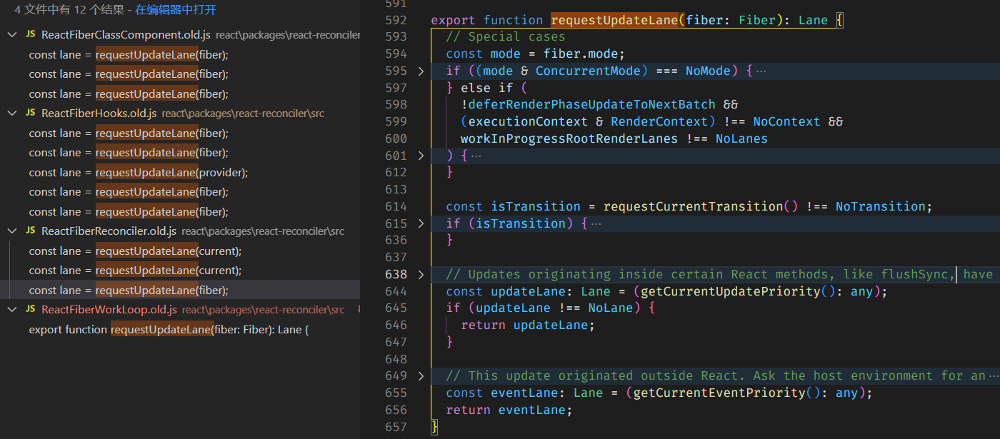

## 为什么要import react

- 由于jsx在编译后需要使用 React.createElement 方法，而jsx本质只是React.createElement的语法糖，因此需要引入。
- 自从17版本之后，官方支持了不需要引入了，新的 jsx  @babel/plugin-transform-react-jsx 插件 会在打包时候自动添加

## React 中, setState 是同步还是异步


**SyntheticEvent** 合成事件

**Event** 原生事件


```jsx

// legacy模式在 promise、setTimeout 、setInterval 、MessageChannel 中 表现为同步的
changeState2 = () => {
    const newCount = this.state.count + 1;
    Promise.resolve().then(() => {
      this.setState({ count: this.state.count + 1});
      if (newCount === this.state.count) {
        console.log('同步执行render');
      }
    });
  };

// concurrent 中都是异步 调度
```


## useState 怎么做缓存的


## 怎么解决 useState 闭包的问题


## 自动批量更新 automatic batched update


### 旧版 legacy 模式

`react\packages\react-reconciler\src\ReactFiberWorkLoop.old.js` 旧版的 function batchedUpdates(fn,a){..}


```js
export function batchedUpdates<A, R>(fn: A => R, a: A): R {
  const prevExecutionContext = executionContext;
  executionContext |= BatchedContext; // 通过在 executionContext 附加 批量更新的上下文 ， 问题在于在 定时器 promise 等异步的回调中无效
  try {
    return fn(a);
  } finally {
    executionContext = prevExecutionContext;
    if (
      executionContext === NoContext &&
      !(__DEV__ && ReactCurrentActQueue.isBatchingLegacy)
    ) {
      resetRenderTimer();
      flushSyncCallbacksOnlyInLegacyMode();
    }
  }
}
```


### concurrent 模式

`react\packages\react-reconciler\src\ReactFiberClassComponent.old.js` enqueueSetState(inst, payload, callback){...}


核心思路：concurrent模式中大部分的任务 是通过 secheduled 调度的。当发现上一次和本次的的调度优先级相同 ，那么就可以取消❎本次的调度。


调用链：enqueueSetState -> scheduleUpdateOnFiber -> ensureRootIsScheduled 

```js
function ensureRootIsScheduled(root: FiberRoot, currentTime: number) {
  // ...
  // We use the highest priority lane to represent the priority of the callback. 我们使用最高优先级的信道来表示回调的优先级
  const newCallbackPriority = getHighestPriorityLane(nextLanes);

  //检查是否存在现有任务。我们也许可以重复使用它。feature: automatic batched update
  const existingCallbackPriority = root.callbackPriority;
    
  if (existingCallbackPriority === newCallbackPriority) return;  // 
}  
```


请求优先级的方法 `requestUpdateLane`

const lane = requestUpdateLane(fiber);




## useState 的实现


## useEffect 的实现


